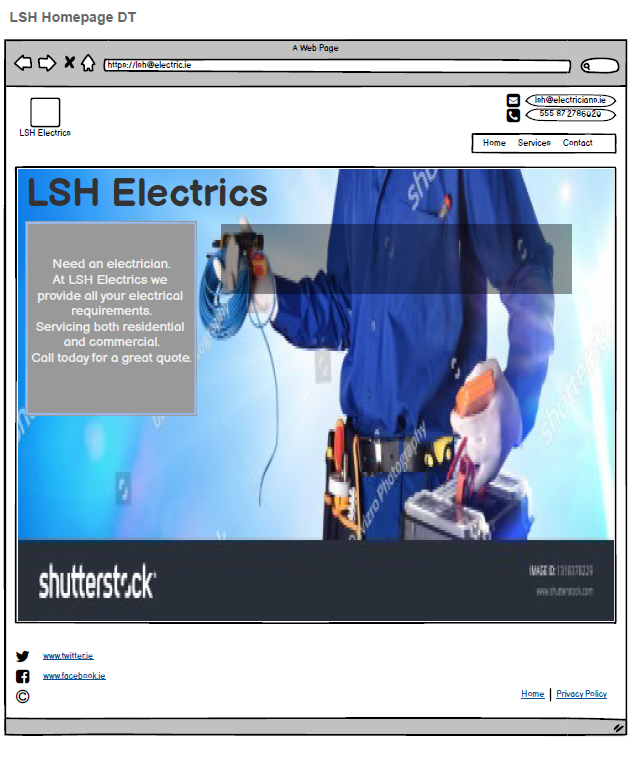
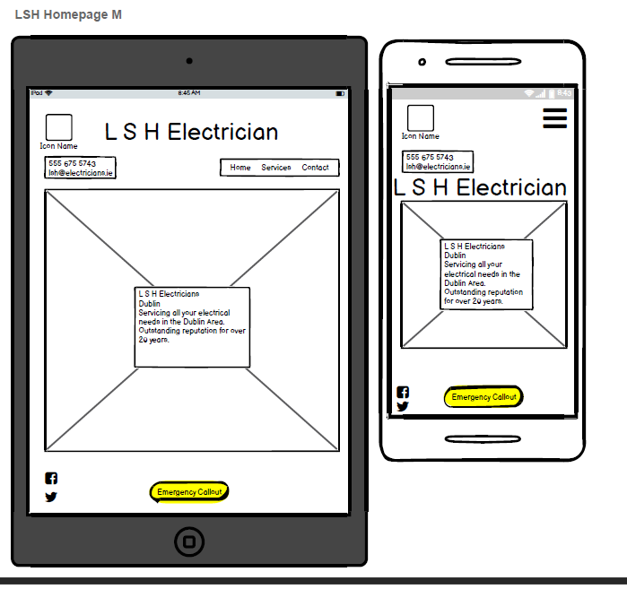
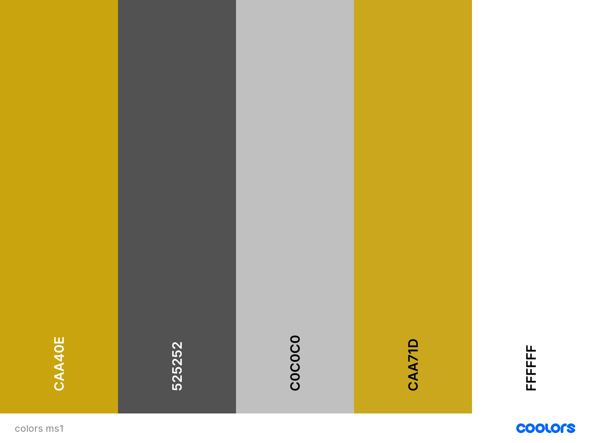
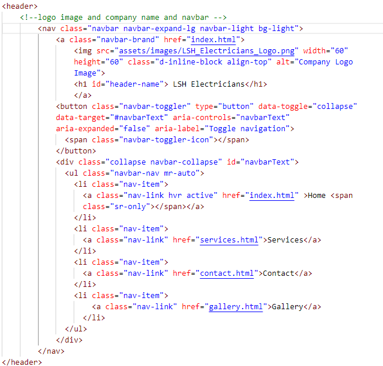
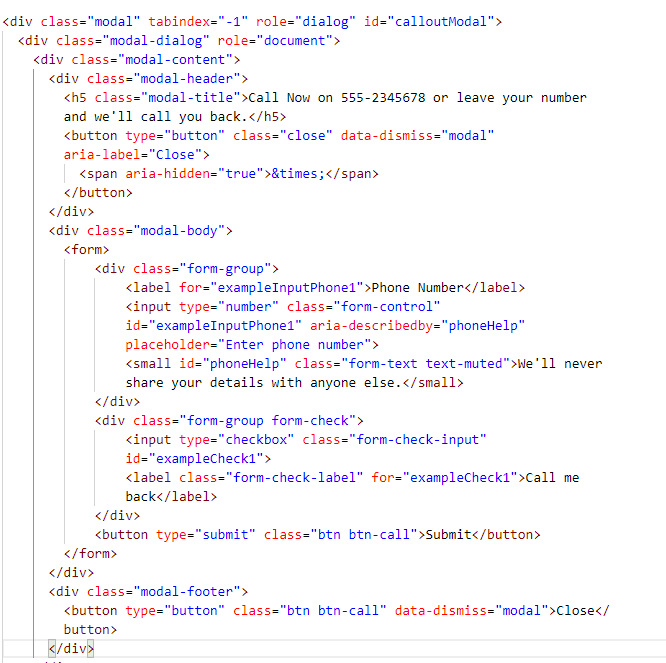
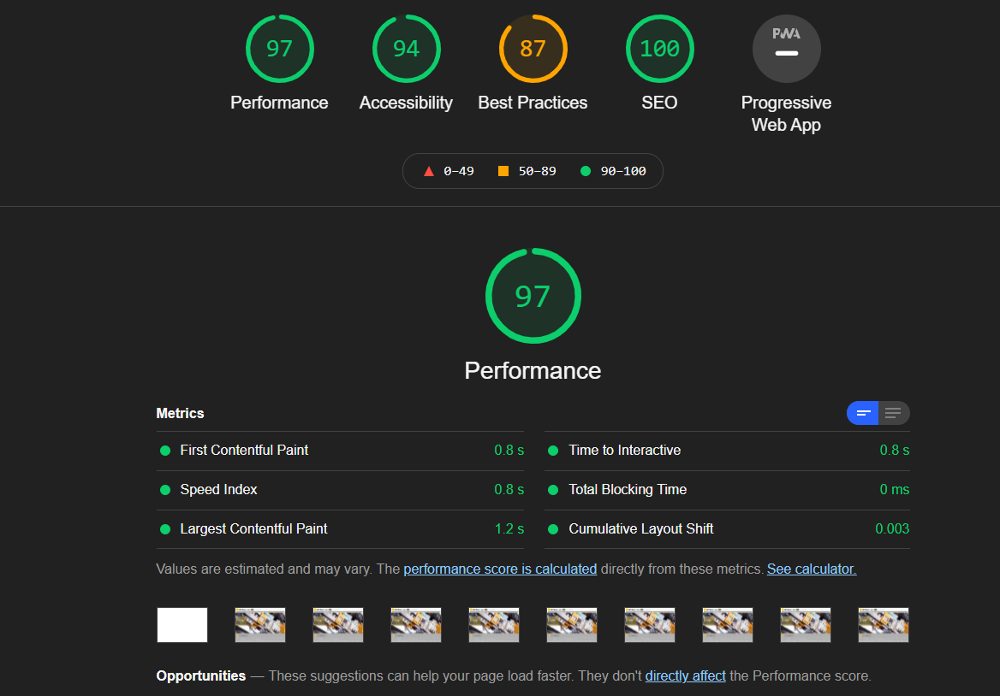
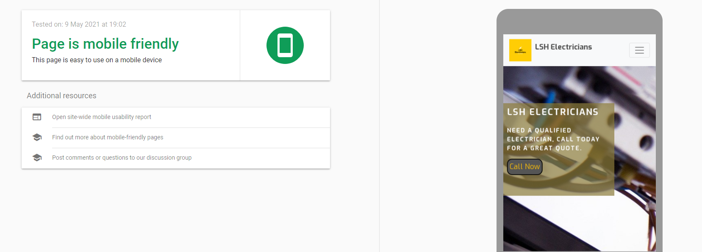
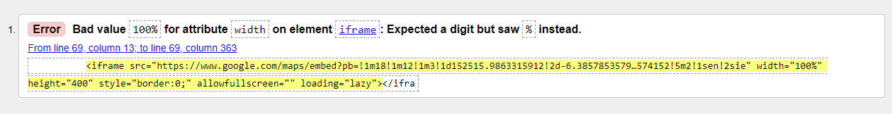
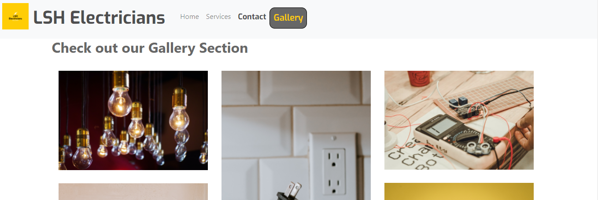
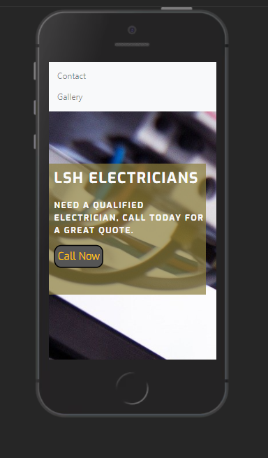

# Milestone Project 1 - LSH Electricians

Click here for a link to the live project on GitHub [LSH_Electricians_MS1](https://leah1977.github.io/LSH_Electricians_MS1/).

This is a User-Centric Frontend Development Project for Milestone 1.

The project features four static pages where customers can see the services LSH Electricians provide.
The project targets potential and returning customers in need of electrical services.
I wanted to create a webpage that would allow the user to see what services we have a available and then to contact us with ease.

## Table of Contents.

1.  [Introduction](#introduction)
2.  [UX](#ux)
    - [Project-Goals](#project-goals)
    - [Strategy](#strategy)
    - [Scope](#scope)
    - [Skeleton](#skeleton)
    - [Features](#features)
    - [Surface-Design](#surface-design)
3.  [Project-Display](#project-display)
4.  [Languages](#languages)
4.  [Technologies](#technologies)
5.  [Testing](#testing)
6.  [Debugging](#testing)
7.  [Deployment](#deployment)
8.  [Acknowledgements](#acknowledgements)

## Introduction

## Welcome!

This site was built using [GitHub Pages](https://pages.github.com/)/.

I have created a mobile-first user-centric frontend project.

I have created a website that focuses on the users needs.  Providing the user with relevant information.  So that the user can contact us for a quote or service as required.
I wanted to keep the website clearly laid out, so that the customer can easily navigate through the site.

Here is a demonstration of how my website looks on different screen sizes using [Am I Responsive Website](http://ami.responsivedesign.is/).

It is intended to be accessible on all screen sizes.  Although I am finding mobile devices are been used more often on a daily basis for searching for services.

## UX

I hope to attract a variety of users, from individual property owners to business property owners.  I hope that users will become clients and reuse the website on a regular basis to book call-outs and services.

## Project Goals.

This website provides information on an electrical service for Domestic and Commercial clients.  LSH Electricians are an electrical company serving the Dublin area.  They serve both domestic and commercial clients.  We have been in business for 20 years and would like to launch a new website to promote our company. 

* To provide a website that is easy to navigate.

* To provide a website that is professional and has clear contact details.

* To provide the user positive feedback from other customers.

* To demonstrate to the user that we comply with saftey standards and are fully insured.

* To provide a clear range of services covering all your electrical needs, from small electrical household jobs to large commercial builds.  

* To provide a form to allow the user to request a quote or call-back.  

## User Stories

### As A First Time User:

* As a website user, I found myself constantly searching for a qualified electrician online but was unsure of what to ask for. I wanted to know did they meet all safety standards and was the work guaranteed.

* As a website user, I needed an electrician for an emergency call out. I wanted to find someone fast, efficient and reliable – quickly. I also needed someone to call out at a time that was convenient to me.

What I expect to find on a website when looking for an electrician.

1. Do they have an emergency call-out option?
2. What times are they available?
3. Are they reliable?
4. What do other customers say about them?

* As a website user, I needed a qualified electrician to check our electrics and certify them for insurance purposes.
I expect to go onto a website and leave knowing that I will be looked after by a reliable electrician.

What I look for on a website when looking for an electrician.

1. Do they work with Safe Electric?
2. Are they registered and certified electricians?
3. Are they reliable?
4. Do they get good reviews?

### As a Regular User:

As a business owner, I want to be able to contact an electrician as needed.  I want to know that I can leave my details and that the company will be in touch to sort out the problem.

As a business owner, I want to be able to purchase items through the website.

With these user stories in mind, I put together some wireframes.  I included all the main requirements and issues that were raised from my user story research.

## Wireframes
---

I have used Balsamique to draw up wireframes for Mobile, iPad and desktop.

I have included wireframes for mobile, iPad and desktop. I plan to build my website from a mobile-first approach.  Using mobiles is becoming one of the more favoured ways to search for local services.

Click here for a link to the Wireframes [Balsamique LSH_Electricians_MS1](assets/wireframes).

## Strategy
---

This website is for property owners, residential or commercial, looking to repair or update their electrics.
I want to provide a service that is easy to navigate, making it clear and quick to provide information and request a quote or call-out.
I will research what may be required for this website by asking the following questions.

* Would you use a website to look for an electrician?
* What would be your primary need for an electrician?
* Would you like a quote?
* What services would you look for?
* Would you like to see previous work completed in a gallery section?
* Would you like to read reviews from customers?

## Scope

Essentials will include

*	Callout - I want the customer to be able to contact our company through phone or email.

*	Emergency - I want the customer to be able to contact our company directly by the touch of a single button.

*	Insurance - I want the customer to know that we are fully qualified and insured electricians.

*	Guarantee - To ensure that the customer knows that we provide a high standard of work that we stand by.

*   A form to request callbacks and quotes - to provide a clear form that we reply to.

*   A gallery page to display work already carried out, showing our level of expertise and skills.

*   Contact details - clearly demonstrate where we are based and how to contact us.
 
## Features
---
This project will include four separate pages.  I decided to separate the website into four separate pages.  The navbar and footer will be displayed on all pages for consistency.

* [index.html](#index.html)
* [services.html](#services.html)
* [contact.html](#contact.html)
* [gallery.html](#gallery.html).

## index.html

The home page is made up of a header.  The header includes a logo, the logo when clicked on will take the user to the home page. The company name and a navigational bar with four menu items also appear in the header.  The header will repeat on all pages.
On small screen sizes, the navigational bar will display as a burger icon, which will expand to a menu when clicked to accommodate the smaller screen size.

There is a Covid-19 notice to appear on the home page. 

The home page includes a large image.  The image is responsive to encourage the customer to focus on the overlay text box. The text box displays a call now button.  When you click on the call now button, a modal will appear.

The home page includes a section telling you about our company and the services we provide.

This page includes a Testimonial section so potential customers can read the reviews of our clients.

The footer has three sections. An about section telling you about the company.  An emergency call out section with a phone link.  The last section is to connect the customer to our social links.

## services.html

The services page has a section on the list of services we provide
 
* Emergency call-out
* Insurance and Testing
* Domestic Electrician
* Commercial Electrician
* Products
* Gallery with link to the Gallery page.

Followed by a Form with a drop-down select menu, to enable the customer to direct their query.

## contact.html

The contact page includes a map of Dublin provided by Google maps. This displays the area in which LSH Electricians work.

Contact and address information for the company.

## gallery.html

The gallery page displays a selection of photos and a video of work LSH Electricians provides.

## Surface Design:
---

## Colour Scheme

I will use the colours in the main body, header and footer.

My main primary colour will be yellow.  I will use variations of this colour to add warmth to the pages.  I have used this colour when I want something to stand out and catch the viewers attention.

I have chosen variations of white and grey to contrast against the yellow colour.  Further enhancing the features.

I used [Coolers](http://www.coolers.co) to generate my colours for the project. I then used variations within the project.

## Typography

I will use the following fonts throughout the website for consistency in style.

 * Roboto
 * Exo
 * Sans Serif as a back up

## Icons

I used [Font Awesome](https://stackpath.bootstrapcdn.com/font-awesome/4.7.0/css/font-awesome.min.css) for all my fonts and they can be seen accross the website, especially on the services page.

## Additional Features

* As our website progresses, I would like to include a search option and a spares/shop section.

* My form is static in this website and through further learning I would like to set it up so that the details can be saved and responded to.

* I would like the call now button to connect directly so that the customer has direct contact with our company.

## Project Display
---

This project is responsive to appear on different screen sizes.
The display changes to accommodate a smaller screen size.  On a mobile, some items have been removed to focus on the mobile-friendly application.  For example, the form reduces in size, so it can be displayed fully on a smaller device.

The navigational bar changes to a burger icon for smaller screen sizes. 
This opens out on click to display the menu items.

I will design the website to adjust to different sized screens to ensure optimum viewing.
I will make sure all links are active and working.

## Languages Used

* [HTML](http://wwww.html.com) Used for all four html pages as the main markup language for this project.
* [CSS](http://www.css-tricks.com) Used to style the content of my website.
* [JavaScript](http://www.javascript.com) Used through Bootstrap.

## Technologies Used
---

Code used throughout this project was learned and implemented from the [Code Institute Diploma Programme](https://codeinstitue.net)

In this project, I used the following to help build my website.

* [Font Awesome](https://stackpath.bootstrapcdn.com/font-awesome/4.7.0/css/font-awesome.min.css) for all the great icons.

* [Google Fonts](https://fonts.googleapis.com/css2?)

* [Bootstrap](https://stackpath.bootstrapcdn.com/bootstrap/4.5.2/css/bootstrap.min.css) throughout this project.

* [Balsamique](https://balsamiq.com/)
  
* [hover.css](https://cdnjs.cloudflare.com/ajax/libs/hover.css/2.1.1/css/hover-min.css).

I used the code from bootstrap for my header.  Here I added a logo and company name.  
I also edited the css styling to suit my website and adjusted the layout to size appropriately.

I used the modal from bootstrap and edited the wording and styling for the call now button on the homepage.

* Google maps link from www.google.com. ("https://www.google.com/maps/embed")

* Thanks to all the photographers and websites Unsplash, Pexels and Pixabay for allowing the use of the following photos and video.

* Light bulbs photo
  Photo by Diz Play on Unsplash

* Photo by <a href="https://unsplash.com/@dizplay?utm_source=unsplash&amp;utm_medium=referral&amp;utm_content=creditCopyText">Diz Play</a> on <a href="https://unsplash.com/s/photos/electricity?utm_source=unsplash&amp;utm_medium=referral&amp;utm_content=creditCopyText">Unsplash</a>

* Fuse box photo
 Photo by Ralph (Ravi) Kayden on Unsplash

* Photo by <a href="https://unsplash.com/@nate_dumlao?utm_source=unsplash&amp;utm_medium=referral&amp;utm_content=creditCopyText">Nathan Dumlao</a> on <a href="https://unsplash.com/s/photos/electricity?utm_source=unsplash&amp;utm_medium=referral&amp;utm_content=creditCopyText">Unsplash</a>

* Photo by Nathan Dumlao on Unsplash

* Photo by <a href="https://unsplash.com/@thkelley?utm_source=unsplash&amp;utm_medium=referral&amp;utm_content=creditCopyText">Thomas Kelley</a> on <a href="https://unsplash.com/s/photos/electric?utm_source=unsplash&amp;utm_medium=referral&amp;utm_content=creditCopyText">Unsplash</a>#
* Photo by Thomas Kelley on Unsplash

* Image by <a href="https://pixabay.com/users/image4you-2459255/?utm_source=link-attribution&amp;utm_medium=referral&amp;utm_campaign=image&amp;utm_content=4198293">Harry Strauss</a> from <a href="https://pixabay.com/?utm_source=link-attribution&amp;utm_medium=referral&amp;utm_campaign=image&amp;utm_content=4198293">Pixabay</a>

* Image from Harry Strauss on Pixabay

* Image 10 "Fusebox" Photo by <a href="https://unsplash.com/@markusspiske?utm_source=unsplash&utm_medium=referral&utm_content=creditCopyText">Markus Spiske</a> on <a href="/s/photos/electrical?utm_source=unsplash&utm_medium=referral&utm_content=creditCopyText">Unsplash</a>
Photo by Markus Spiske on Unsplash

* Image11 "Ligths" Photo by <a href="https://unsplash.com/@impatrickt?utm_source=unsplash&utm_medium=referral&utm_content=creditCopyText">Patrick Tomasso</a> on <a href="/s/photos/electrical?utm_source=unsplash&utm_medium=referral&utm_content=creditCopyText">Unsplash</a>
Photo by Patrick Tomasso on Unsplash  

* Image 12 "volt" Photo by <a href="https://unsplash.com/@shirishsuwal?utm_source=unsplash&utm_medium=referral&utm_content=creditCopyText">Shirish Suwal</a> on <a href="/s/photos/electrical?utm_source=unsplash&utm_medium=referral&utm_content=creditCopyText">Unsplash</a>
Photo by Shirish Suwal on Unsplash  

* Image 13 "Tool" Photo by <a href="https://unsplash.com/@mbaumi?utm_source=unsplash&utm_medium=referral&utm_content=creditCopyText">Mika Baumeister</a> on <a href="/s/photos/electrical?utm_source=unsplash&utm_medium=referral&utm_content=creditCopyText">Unsplash</a>
Photo by Mika Baumeister on Unsplash 

* Image 14 "lightbub" Photo by <a href="https://unsplash.com/@daniele_franchi?utm_source=unsplash&utm_medium=referral&utm_content=creditCopyText">Daniele Franchi</a> on <a href="/s/photos/electrical-led-lights?utm_source=unsplash&utm_medium=referral&utm_content=creditCopyText">Unsplash</a>
Photo by Daniele Franchi on Unsplash

* Image 15 "security lights" Photo by <a href="https://unsplash.com/@switch_dtp_fotografie?utm_source=unsplash&utm_medium=referral&utm_content=creditCopyText">Lucas van Oort</a> on <a href="/s/photos/security-led-lights?utm_source=unsplash&utm_medium=referral&utm_content=creditCopyText">Unsplash</a>
Photo by Lucas van Oort on Unsplash  

* Image 16 "Plug socket" Photo by <a href="https://unsplash.com/@hamishkale_?utm_source=unsplash&utm_medium=referral&utm_content=creditCopyText">Hamish Kale</a> on <a href="/s/photos/plug-socket?utm_source=unsplash&utm_medium=referral&utm_content=creditCopyText">Unsplash</a>Photo by Hamish Kale on Unsplash

* Image 17 "Electrical wire."
Photo by <a href="https://unsplash.com/@steve_j?utm_source=unsplash&utm_medium=referral&utm_content=creditCopyText">Steve Johnson</a> on <a href="/s/photos/electrical-wire?utm_source=unsplash&utm_medium=referral&utm_content=creditCopyText">Unsplash</a>
Photo by Steve Johnson on Unsplash

* Image for wireframe Photo by Royalty-free stock photo ID: 1318378229 Background with a uniformed electrician with tools and electrical equipment and blue background. By Davizro Photography www.shutterstock.com

* Testimonial Image 1. Photo by <a href="https://unsplash.com/@everythingcaptured?utm_source=unsplash&utm_medium=referral&utm_content=creditCopyText">Edward Cisneros</a> on <a href="/t/people?utm_source=unsplash&utm_medium=referral&utm_content=creditCopyText">Unsplash</a>
Photo by Edward Cisneros on Unsplash

* Testimonial Image 2. Photo by <a href="https://unsplash.com/@gabiontheroad?utm_source=unsplash&utm_medium=referral&utm_content=creditCopyText">Gabriella Clare Marino</a> on <a href="/t/people?utm_source=unsplash&utm_medium=referral&utm_content=creditCopyText">Unsplash</a>
Photo by Gabriella Clare Marino on Unsplash

* Photo by <a href="https://unsplash.com/@bulava92?utm_source=unsplash&utm_medium=referral&utm_content=creditCopyText">Vladislav Bulatov</a> on <a href="https://unsplash.com/s/photos/electrical-wiring?utm_source=unsplash&utm_medium=referral&utm_content=creditCopyText">Unsplash</a>

* Video  

Video by Kapaw from Pexels  

## Further References
- Confident Coding by Rob Percival
- Confident Web design by Kenny Wood
- Patreon 
- [YouTube](https://www.youtube.com/) 
- [W3Schools](https://www.w3schools.com/) used for information to help in css styling
- [AmIResponsive](http://ami.responsivedesign.is/)

---
## Deployment Section

---

I used the programme [Gitpod](www.gitpod.io) in the development of this project.  I pushed it to GitHub using the CLI, which is built into Gitpod.

### To deploy this project to GitHub from its Gitpod repository - please follow these steps.

1. Log in to http://www.github.com
2. Click on "Your Repositories" from the dropdown menu and select LSH_Electricians_MS1.
3. Go to the list of options and select Settings.
4. Scroll down to GitHub pages.
5. Under source, click the drop-down menu and select branch: master.
6. Your page then refreshes, and your site is deployed.
7. Scroll back down to GitHub pages, and you are now provided with a link to your deployed website.

### To clone this project into Gitpod, you should follow these steps.

1. Open your Github account or create one.
2. Use the Chrome browser.
3. Install the extension for Gitpod.
4. Log into your gitpod account.
5. Navigate to the Project GitHub repository.
6. Under the Repository LSH_Electricians_MS1, click download.
7. This will trigger a new gitpod workspace that you can work on.

## Testing

## Tested the site using Lighthouse 

## Tested HTML

[W3C Markup Validation Service](https://validator.w3.org/)

- Tested index.html W3C Markup Validation Service - no errors or warnings to show.
- Tested services.html W3C Markup Validation Service - no errors or warnings to show.
- Tested gallery.html W3C Markup Validation Service - no errors or warnings to show.
- Tested contact.html W3C Markup Validation Service - no errors or warnings to show.

## Tested the site for mobile friendly usage

[Mobile-Friendly Test-Google Services](https://search.google.com/test/mobile-friendly)

## Tested the Logo

Tested the logo on all pages. Clicking on the logo will return you to the home page.

**Expected**

When you click on the logo, it is expected that the link will return you to the homepage.

**Testing**

Tested the logo on each page by clicking on the logo image.

**Result**

The site acted as expected and returned to the home page.

**Fix**

No fix required.

## Tested the Navigational Bar

Tested all links on all pages. All links work as intended. This allows the user to move from one page to another with ease.
On mobile devices, the navigational bar reduces in size and displays two by two to accommodate the smaller screen size.

**Expected**

When you click on the home menu item, it is expected that the link will return you to the home page.  It is expected that the home page will be highlighted with a border to confirm you are on the homepage.

**Testing**

Tested the home menu item on each page by clicking on the home menu item.

**Result**

The site acted as expected and returned to the home page.  The menu item displays a black border, when on the home page.

**Expected**

When you click on the services menu item, it is expected that the link will direct you to the services page.  It is expected that the services page will be highlighted with a border to confirm you are on the services page.

**Testing**

Tested the service menu on each page by clicking on the services menu item.

**Result**

The site acted as expected and directed me to the services page.  The services menu item had a black border around it when I was on the services page.

**Expected**

When you click on the contact menu item, it is expected that the link will direct you to the contact page.  It is expected that the contact page will be highlighted with a border to confirm you are on the contact page.

**Testing**

Tested the contact menu item on each page by clicking on the contact menu item.

**Result**

The site acted as expected and directed me to the contact page.  The contact menu item had a black border around it when I was on the contact page.

**Expected**

When you click on the gallery menu item, it is expected that the link will return you to the gallery page.  It is expected that the gallery page will be highlighted with a border, to confirm you are on the gallery page.

**Testing**

Tested the gallery menu item on each page by clicking on the Gallery menu item.

**Result**

The site acted as expected and directed me to the home page.  The gallery menu item had a black border around it when I was on the gallery page.

**Fix**

No fix required

## Tested the Footer contact link

Tested the footer contact link on all pages. Clicking on the phone link, the link should change colour when you hover over it and when clicked will redirect you to the home page.

**Expected**

When you click on the phone link, it is expected that the link will change colour.  As this is a static website, no further action will happen.

**Testing**

Tested the phone link on each page by clicking on the phone link.

**Result**

The site acted as expected, the link changed colour.

**Fix**

No fix required.

## Tested the social contact links in the footer

Tested the social contact links on all pages. Clicking on a social link, link should change colour when you hover over it and, when clicked, will redirect you to the relevant page in a new window.

**Expected**

When you hover over the social link, it is expected that the link will change colour. When you click on the social link you will be redirected to the relevant page in a new window.

**Testing**

Tested the social link on each page by clicking on the social links.

**Result**

The site acted as expected, and the link changed colour when you hover over it and redirects you to a new page when you click on it.

**Fix**

No fix required.

## Tested the modal

Tested the modal on the home page. 

**Expected**

When you click on the call now button, a modal will pop up.  The modal will have buttons to submit and close the page. It is expected that the submit button will be static.  It is expected the close button will close the modal and return you to the home page.

**Testing**

Tested the model on the home page by clicking on the call now button.
Tested the submit button by clicking on it.
Tested the close button by clicking on it.

**Result**

The site acted as expected, and a modal appeared when I clicked on the call now button.
The site acted as expected when I clicked on the submit button. Returns to home page after clicking on submit.
The site acted as expected when I clicked on the close button, the modal closed and returned to the home page.

**Fix**

No fix required.

## Tested the form on the services page.

Tested the form. Entered in details to each relevant section.
I checked the submit button by clicking on it.
Click on the Clear Form button to clear the form.

**Expected**

When you enter in your details, they are displayed as entered.
When you click on the submit button, the form is submitted - this site is static.
When you click on the clear form button, the form clears.

**Testing**

Tested the form by filling out details for all sections.

**Result**

The Name field fills out as expected, and if left blank, a "Fill out this field" will pop up.
The Email field fills out as expected. If an email address is not correctly entered, a "Enter an email address" will pop up.
The Phone field fills out, but if letters are entered, a "Enter a number" will pop up.
The message section allows for a description of the job request.
The date required calendar pops up, and the user can select the date as required.

The form appears to the left on an iPad.  It should be centered.

**Fix**

Amend media query for iPad so that the form appears in the center.

##Testing across various devices

- Ensured the website was responsive on all pages through [Google Mobile Friendly](https://search.google.com/test/mobile-friendly)

- Ensured the website was responsive on different mobiles using [BrowserStack](https://www.browserstack.com/)

- Testing was also performed on Safari and Chrome

- Testing was also carried out by several family members.

Implement the user stories.

### User Story 1

* From the home page
* Click on services in the navigational bar.
* Scroll to Insurance and Testing to see that we meet all safety standards.
* Scroll further to fill out the form and request a call-back.

### User Story 2

* On the home page, click the call now button for adirect phone line.
* Alternatively, click on the services page in the navig
ational bar.
* Fill out the form and select "Emergency Call-out" from the drop-down, select option.
* Choose the date you would like the call-out on this form also.

### User Story 3

* On the home page, click on the services in the navigational bar.
* Read through all the registered and certified services we provide.
* Click on the Gallery page to read testimonials, provide customer feedback on our services.
* Fill out our form to start the process today!
--- 

##  Debugging
---

###     Debugging HTML in index.html
---

* Title displaying above Logo on all pages. Trying to position Title in the center of the Navbar or to the right of the logo.

* Added the bootstrap class "float-right" to the h1 element

* Navbar was displaying too close to the logo and title.  After a lot of trial and error and some much needed mentoring.  Fixed the bug by reversing the text-direction.  Styled as a media query.

@media screen and (min-width: 992px) {
   
   .navbar-expand-lg .navbar-collapse {
       flex-direction: row-reverse;
   }
}

This worked as I had intended.

* Burger icon was diplaying below logo on small screens.  This was not how I intended it to look, so I reduced the font size of the title on small screen sizes.

### Debugging HTML in services.html
---

* Items were displaying unevenly on larger screen sizes.

* Changed the bootstrap column class to display 3 items at a time instead of 4.

* Form was appearing too large on the desktop.

* Added a max-width to prevent the form from displaying full width on desktop.

* Form was displaying to the left on the iPad screen size.
* Adjusted the code by giving it a margin of 10px auto.  Also changed the max-width to 70% so it would not take up the whole width on an iPad screen size.

`.center-form {
        
    min-height: 240px;
    margin: 10px auto;
    max-width: 70%;
  }`

Tested services .html W3C Markup Validation Service - no errors or warnings to show.

## Debugging on the contacts page
---
     
* Google map was not responsive on mobile devices.

* The google map was not displaying correctly when on smaller screen sizes.

* To solve this issue, I change the width to 100% so that it would appear the full width of the screen on all devices.

* The map would not pass through the html validator as a result of using a %.  Although it did work as intended on the the website.

* To fix this bug I created an id for the map and inserted the width and height into the style.css.  I then add media queries as neccessary for the smaller screen sizes.

## Debugging on the Gallery page
---

* Title of gallery section was displaying left of all images.

* Inserted a section container and gave it the title of the Gallery to display above the images.

## CSS debugging

---

* media query for menu items in the header was set too large for some devices.
* added an extra small media query for small screen sizes

` @media screen and (max-width: 575px) {
   
 h1 {
     font-size: 20px;

 }

h2 {
    font-size: 1em;
    text-align: right;
    margin: 0;
    padding-right: 10px;
}
 
} ` 

* Overlay not responsive. Missing half the writing when the screen size reduced.
* Added a media query in CSS to incorporate overlay to make it responsive.

* Large area of white space appearing below gallery on services.html page.
* Fix max-width on media query to remove white space.

## Tested on W3C CSS Validator

[W3C CSS Validator](https://jigsaw.w3.org/css-validator/)

    

            

## Acknowledgements
---

Much thanks to my mentor Nishant Kumar for giving great support and encouragement throughout my first Milestone Project.

Much thanks to Code Institute Tutors for pointing me in the right direction when I was going off course.

Thanks also to support from the Slack Community. 

Thanks also to the support of my husband and family supporting me through this project and providing invaluable feedback.

