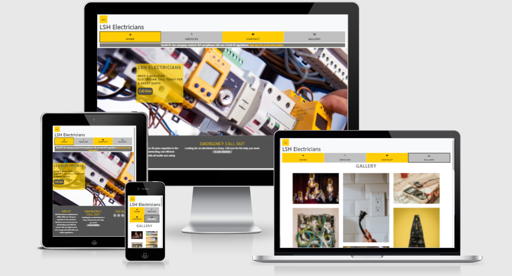
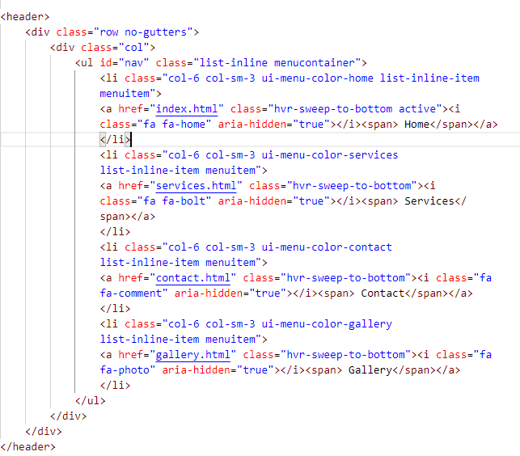
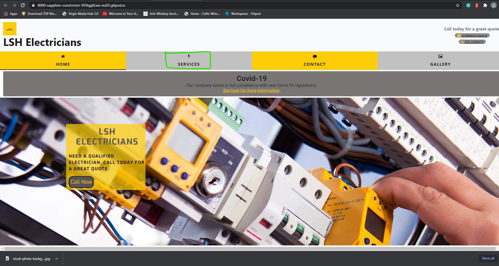
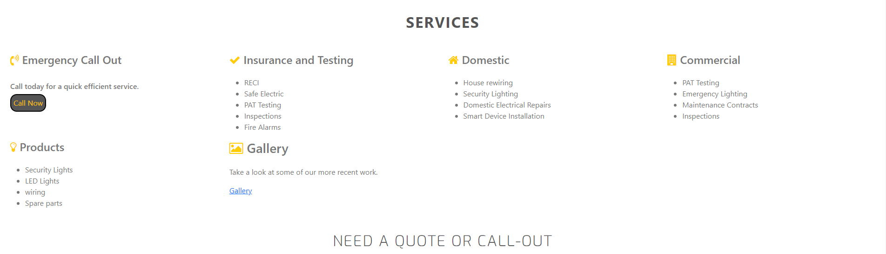
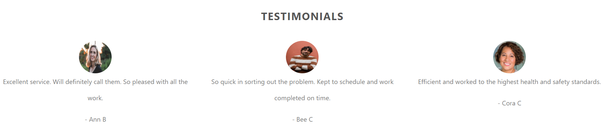
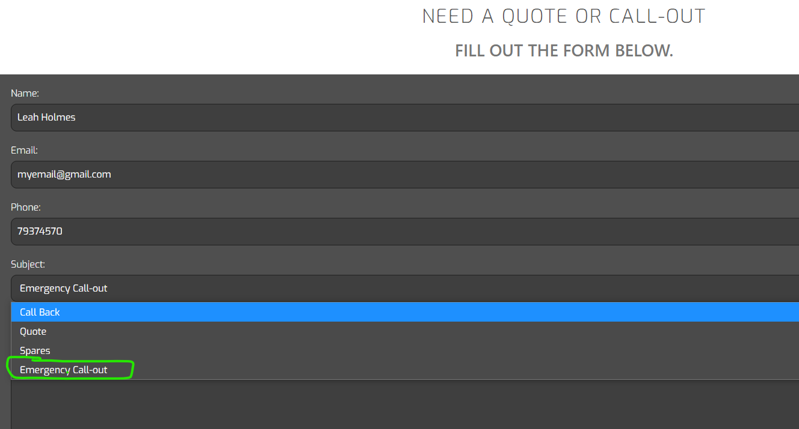
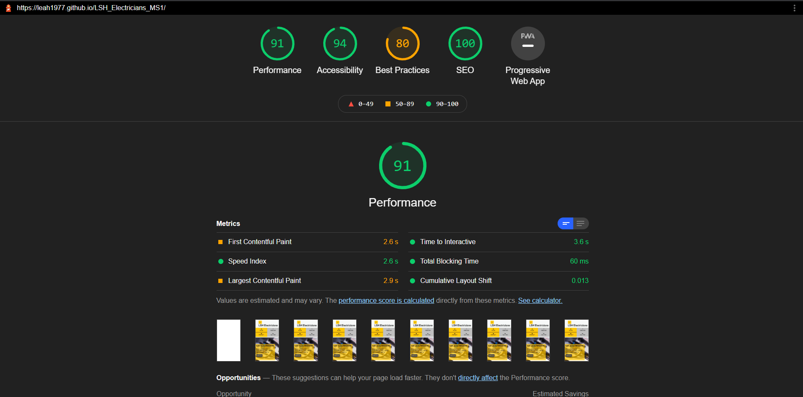

# Milestone Project 1 - LSH Electricians

### Click here for a link to the live project on GitHub [LSH_Electricians_MS1](https://leah1977.github.io/LSH_Electricians_MS1/)

### This is a User Centric Frontend Development Project for Milestone 1.

### The project features four static pages where customers can see the services LSH Electricians provide.

### The project targets potential and returning customers in need of electrical services.

## Table of Contents.

1.  [Introduction](#introduction)
2.  [UX](#ux)
    - [Project-Goals](#project-goals)
    - [Strategy](#strategy)
    - [Scope](#scope)
    - [Skeleton](#skeleton)
    - [Features](#features)
    - [Design](#design)
3.  [Project-Display](#project-display)
4.  [Technologies](#technologies)
5.  [Testing](#testing)
6.  [Debugging](#testing)
7.  [Deployment](#deployment)
8.  [Acknowledgements](#acknowledgements)

## Introduction

## Welcome!

### This site was built using [GitHub Pages](https://pages.github.com/)/.

### I have created a mobile first project

### Here is a demonstrating of how my website looks on different screensizes using [Am I Responsive Website](http://ami.responsivedesign.is/)

## UX

## Skeleton:
---

### I have used Balsamique to draw up 3 page wireframes for Mobile, iPad and Desktop.

### I have included wireframes for mobile, ipad and desktop. I plan to build my website from a mobile first approach.  Using mobiles is becoming one of the more favoured ways to search for local services.

### Click here for a link to the Wireframes [Balsamique LSH_Electricians_MS1](assets/wireframes)

## Project Goals.

### This website provides information on an electrical service for Domestic and Commercial clients.  LSH Electricians are an electrical company serving the Dublin area.  They serve both domestic and commercial clients.  We have been in business for 20 years and would like to launch a new website to promote our company. 

### We provide a range of services covering all your electrical needs.  From small electrical household jobs to large commercial builds.  
### We quote for all job sizes.  
### We specialize in emergency call-outs.  
### Providing you with the service you need when you need it.

### This website demonstrates the services we provide and enables you to book a call out or request a quote.

## Strategy
---

### This website is for owners of properties, residential or commercial who are looking to repair or update their electrics.
### I want to provide a service that is easy to navigate. 
### Making it clear and quick to provide information and request a quote or call-out.
### I will research what may be required for this websit by asking the following questions to a selection of people.

* Would you use a website to look for an electrician?
* What would be your main need for an electrician?
* Would you like a quote?
* What services would you look for?
* Would you like to see previous work completed in a gallery section?
* Would you like to read reviews from customers?

## User Story 1

### As a website user, I found myself constantly searching for a qualified electrician online but was unsure of what to ask for. I wanted to know did they meet all safety standards and was the work guaranteed.

### What I expect to find on a website when looking for an electrician.
 
1. Easy to navigate.
2. Easy to find contact details.
3. Clearly displays the work they carry out.
4. Do they comply with safety standards.

## User Story 2

### As a website user, I needed an electrician for an emergency call out.  I wanted to find someone fast, efficient and reliable – quickly.  I also needed the someone to call out at a time that was convenient to me.

### What I expect to find on a website when looking for an electrician.

1. Do they have an emergency call out option.
2. What times are they available?
3. Are they reliable?
4. What do other customers say about them.

## User story 3

### As a website user, I needed a qualified electrician to check our electrics and certify them all for insurance purposes.
### I expect to be able to go onto a website and leave knowing that I will be looked after by a reliable electrician.

### What I look for on a website when looking for an electrician.

1. Do they work with Safe Electric.
2. Are they registered and certified electricians.
3. Are they reliable?
4. Do they get good reviews?

### With these user stories in mind, I put together some wireframes.  I included all the main requirements and issues that were raised from my user story research.

## Scope

### Essentials will include

*	Call out
*	Emergency
*	Insurance
*	Guarantee
*   A form for request call backs and quotes
*   A gallery page to display work
*   Contact details
 
## Features
---
#### This project will include four separate pages.  

* Home page
* Services page
* Contact page
* Gallery page.

## Home page

### The home page is made up of a header.  The header includes a logo and two links for quick contact to be made through email or phone.  The header will repeat on all pages.

### There is a navagational bar with working links to all four pages.  This will appear on all four pages.

### There is a Covid-19 notice to appear on the home page. 

### The home page includes a large image.  The image is responsive to encourage the customer to focus on the overlay text box. The text box displays a call-now button in blue to draw the customers eye again.

### The footer has three sections.  An about section telling you about the company.  An emergency call out section with phone link.  The last section is to connect the customer to our social links.

## Services Pages

### The services page has a section on the list of sevices we provide
 
* Emergency call out
* Insurance and Testing
* Domestic Electrician
* Commercial Electrician
* Products
* Gallery with link to Gallery page.

### Followed by a Form with a drop down select menu, to enable the customer to direct their query.

## Contact Pages

### The contact page includes a map of Dublin provided by Google maps. This displays the service in which LSH Electricians work.

### Contact and address information for the company.

## Gallery page

### The gallery page displays some photos and a video of work LSH Electricians provides.

### This page includes a Testimonial section so customers can read our reviews.

# Design:
---

## Color Scheme

### I will use the colors in the main body, header and footer

### My main primary color will be yellow.  I will use variations of this color to add warmth to the pages.  I have used this color when I want something to stand out and catch the viewers attention.

### I have chose variations of white and grey to contrast against the yellow color.  Further enhancing the features.

### I used [Coolers](http://www.coolers.co) to generate my colours for the project. I then used variations within the project.

## Typography

### I will use the following fonts throughout the website for consistency in style.

 * Roboto
 * Exo
 * Sans Serif as a back up

## Additional Features

### As our website progresses I would like to include a search option and a spares/shop section.

## Project Display
---

### This project is responsive to appear on different screen sizes.
### The display changes to accomodate smaller screensize.  On a phone some items have been removed to focus on the mobile friendly application.  For example the form reduces in size, so it can be displayed fully on a smaller device.

### The navigational bar also displays in a two by two format to accomodate the smaller screen size.

### I will design the website to adjust to different sized screens to ensure optimum viewing.
### I will make sure all links are active and working.

## Technologies-used
---

### Code used throughout this project was learned and implimented from the [Code Institute Diploma Programme](https://codeinstitue.net)

### In this project I used the following to help build my website.

### In this project I have used [Font Awesome](https://stackpath.bootstrapcdn.com/font-awesome/4.7.0/css/font-awesome.min.css) for all the great icons.

### In this project I have used [Google Fonts](https://fonts.googleapis.com/css2?)

### I have used [Bootstrap](https://stackpath.bootstrapcdn.com/bootstrap/4.5.2/css/bootstrap.min.css) throughtout this project.

  
### I have used [hover.css](https://cdnjs.cloudflare.com/ajax/libs/hover.css/2.1.1/css/hover-min.css).

### google maps link from www.google.com. ("https://www.google.com/maps/embed")

### Thanks to all the photograhpers and websites Unsplash, Pexels and Pixabay for allowing the use of following photos and video.

### Light bulbs photo
### Photo by Diz Play on Unsplash

### Photo by <a href="https://unsplash.com/@dizplay?utm_source=unsplash&amp;utm_medium=referral&amp;utm_content=creditCopyText">Diz Play</a> on <a href="https://unsplash.com/s/photos/electricity?utm_source=unsplash&amp;utm_medium=referral&amp;utm_content=creditCopyText">Unsplash</a>

### Fuse box photo
### Photo by Ralph (Ravi) Kayden on Unsplash

### Photo by <a href="https://unsplash.com/@nate_dumlao?utm_source=unsplash&amp;utm_medium=referral&amp;utm_content=creditCopyText">Nathan Dumlao</a> on <a href="https://unsplash.com/s/photos/electricity?utm_source=unsplash&amp;utm_medium=referral&amp;utm_content=creditCopyText">Unsplash</a>

### Photo by Nathan Dumlao on Unsplash

### Photo by <a href="https://unsplash.com/@thkelley?utm_source=unsplash&amp;utm_medium=referral&amp;utm_content=creditCopyText">Thomas Kelley</a> on <a href="https://unsplash.com/s/photos/electric?utm_source=unsplash&amp;utm_medium=referral&amp;utm_content=creditCopyText">Unsplash</a>#
### Photo by Thomas Kelley on Unsplash

### Image by <a href="https://pixabay.com/users/image4you-2459255/?utm_source=link-attribution&amp;utm_medium=referral&amp;utm_campaign=image&amp;utm_content=4198293">Harry Strauss</a> from <a href="https://pixabay.com/?utm_source=link-attribution&amp;utm_medium=referral&amp;utm_campaign=image&amp;utm_content=4198293">Pixabay</a>
### Image from Harry Strauss on Pixabay

### Image 10 "Fusebox" Photo by <a href="https://unsplash.com/@markusspiske?utm_source=unsplash&utm_medium=referral&utm_content=creditCopyText">Markus Spiske</a> on <a href="/s/photos/electrical?utm_source=unsplash&utm_medium=referral&utm_content=creditCopyText">Unsplash</a>
Photo by Markus Spiske on Unsplash

### Image11 "Ligths" Photo by <a href="https://unsplash.com/@impatrickt?utm_source=unsplash&utm_medium=referral&utm_content=creditCopyText">Patrick Tomasso</a> on <a href="/s/photos/electrical?utm_source=unsplash&utm_medium=referral&utm_content=creditCopyText">Unsplash</a>
Photo by Patrick Tomasso on Unsplash  

### Image 12 "volt" Photo by <a href="https://unsplash.com/@shirishsuwal?utm_source=unsplash&utm_medium=referral&utm_content=creditCopyText">Shirish Suwal</a> on <a href="/s/photos/electrical?utm_source=unsplash&utm_medium=referral&utm_content=creditCopyText">Unsplash</a>
Photo by Shirish Suwal on Unsplash  

### Image 13 "Tool" Photo by <a href="https://unsplash.com/@mbaumi?utm_source=unsplash&utm_medium=referral&utm_content=creditCopyText">Mika Baumeister</a> on <a href="/s/photos/electrical?utm_source=unsplash&utm_medium=referral&utm_content=creditCopyText">Unsplash</a>
Photo by Mika Baumeister on Unsplash 

### Image 14 "lightbub" Photo by <a href="https://unsplash.com/@daniele_franchi?utm_source=unsplash&utm_medium=referral&utm_content=creditCopyText">Daniele Franchi</a> on <a href="/s/photos/electrical-led-lights?utm_source=unsplash&utm_medium=referral&utm_content=creditCopyText">Unsplash</a>
Photo by Daniele Franchi on Unsplash

### Image 15 "security lights" Photo by <a href="https://unsplash.com/@switch_dtp_fotografie?utm_source=unsplash&utm_medium=referral&utm_content=creditCopyText">Lucas van Oort</a> on <a href="/s/photos/security-led-lights?utm_source=unsplash&utm_medium=referral&utm_content=creditCopyText">Unsplash</a>
Photo by Lucas van Oort on Unsplash  

### Image 16 "Plug socket" Photo by <a href="https://unsplash.com/@hamishkale_?utm_source=unsplash&utm_medium=referral&utm_content=creditCopyText">Hamish Kale</a> on <a href="/s/photos/plug-socket?utm_source=unsplash&utm_medium=referral&utm_content=creditCopyText">Unsplash</a>Photo by Hamish Kale on Unsplash

### Image 17 "Electrical wire"
Photo by <a href="https://unsplash.com/@steve_j?utm_source=unsplash&utm_medium=referral&utm_content=creditCopyText">Steve Johnson</a> on <a href="/s/photos/electrical-wire?utm_source=unsplash&utm_medium=referral&utm_content=creditCopyText">Unsplash</a>
Photo by Steve Johnson on Unsplash

### Image for wireframe Photo by Royalty-free stock photo ID: 1318378229
### Background with uniformed electrician with tools and electrical equipment and blue background. By Davizro Photography www.shutterstock.com

### Testimonial Image 1. Photo by <a href="https://unsplash.com/@everythingcaptured?utm_source=unsplash&utm_medium=referral&utm_content=creditCopyText">Edward Cisneros</a> on <a href="/t/people?utm_source=unsplash&utm_medium=referral&utm_content=creditCopyText">Unsplash</a>
Photo by Edward Cisneros on Unsplash

### Testimonial Image 2. Photo by <a href="https://unsplash.com/@gabiontheroad?utm_source=unsplash&utm_medium=referral&utm_content=creditCopyText">Gabriella Clare Marino</a> on <a href="/t/people?utm_source=unsplash&utm_medium=referral&utm_content=creditCopyText">Unsplash</a>
Photo by Gabriella Clare Marino on Unsplash

### Video  

Video by Kapaw from Pexels  

## Further References
- Confident Coding by Rob Percival
- Confident Webdsign by Kenny Wood
- Patreon 
- YouTube 

---

## Testing

### Implement the user stories.

### User Story 1

### **From the home page**
### **Click on services in the navagational bar.**
### **Scroll to Insurance and Testing to see that we meet all safey standards.**
### **Scroll further to fill out form and request a call-back.**
### **Alternative options click on Phone or email link for direct enquiry.**

### User Story 2

### **On the home page click the call now button for direct phone line.**
### **Alterantively click on the services page in the navagational bar.**
### **Fill out the form and select "Emergency Call-out" from the drop-down select option.**
### **Choose the date you would like the call-out on this form also.**

### User Story 3

### **On the home page click on the services in the navagational bar.**

### **Read through all the registered and certified services we provide.**

### **Click on the Gallery page to read testimonials, provide customer feeback on our services.**

### **Fill out our form to start the process today!**

--- 

### Tested the site using Lighthouse 

## Logo

### Tested the logo on all pages. Clicking on the logo will return you to the home page.

## Navigational Bar

### Tested all links on all pages. All links work as intended. This allows the user to move from one page to another with ease.
### On mobile devices the navagational collapses and is displayed as a hamburger sign.  I used Bootstrap for this.

##  Debugging
---

##      Debugging HTML in index.html
---

###     Duplicate attribute of a class.
####    Fix duplicate attribute by removing extra class reference.

###     Missue of aria-label
####    Fix use of aria-label, removed in this instance, as not required.

####    Amend same errors on all html pages.

## Debugging HTML in services.html
---

###     Duplicate attribute of a class.
####    Fix duplicate attribute by removing extra class reference.

###     Missue of aria-label
####    Fix use of aria-label, removed in this instance, as not required.

###     Use of p element in a span.
####    Replace with h3 element.

###     Stray end tag
####    Fix by deleting stray end tag. Remove </btn>

###     ul element used as child element of a span in error
####    removed as child element

###     unclosed element for blockquote
####    closed element

###     section lacks heading
####    Assign heading to section

##      Debugging on contacts page
---

###     bad attribute applied for iframe
####    adjust value attribute from % to figure

###     text not allowed in this style in iframe attribute          

##      Debugging on gallery page
---

###     incorrect placement of quotation marks
####    correct placement

###     Error: Duplicate attribute alt.
####    Remove duplicate attribute.

###     Warning: Section lacks heading. 

## CSS debugging

---

### 	h2	Value Error : text-transform "Exo" is not a text-transform value :          "Exo",sans-serif
####    removed extra quotation marks

### 	h2	Value Error : letter-spacing uppercase is not a letter-spacing              value : uppercase
####    amended letter spacing value

### 	.name	Parse Error sans-serif"; font-weight: 100;
####    removed extra quotation marks

### 	.services-list	Value Error : background-color none is not a          background-color value : none
####    removed background-color value

### 	#photo img	4px is not a border-image value : 4px solid black
####    amended value

### 	#photo img	Property padding-block doesn't exist : 5px
####    removed padding-block as not required

### 	#photo img	Property margin-block-start doesn't exist : auto
####    removed margin-block-start as not required.

###     Call out button is covering text.
####     Fixed error by adding padding to the css.

###     Logo not displaying in image format.
####    Incorrect file path.  Changed to the relative path.

###     HeroImage not loading.
####    Incorrect file path.  Changed to the relative path. 

###     Overlay not responsive. Missing half the writing when the screen size           reduced.
####    Added a query css to incorporate overlay to make it responsive.

###     Background colour blue when hovering over navbar item.
####    Left space between rgba and brackets in background color for hover              class.  Removed space and grey colour was restored.

###     Form not centering on page/overlapping footer.
####    Adjust padding and css styling to fix centering issue and overlapping of footer.

###     Large area of white space appearing below gallery on services.html page.
####    Fix max-width on query to remove white space.

    

## Deployment Section

---

### I used the programme [Gitpod](www.gitpod.io) in the developing of this project.  I pushed it to GitHub using the CLI which is built into Gitpod.

### To deploy this project to GitHub from its Gitpod repository - please follow these steps.

1. Log into http://www.github.com
2. Click on "Your Repositories" from the dropdown menu and select LSH_Electricians_MS1.
3. Go to the list of options and select Settings.
4. Scroll down to GitHub pages.
5. Under source click the drop down menu and select branch: master.
6. Your page then refreshes and your site is deployed.
7. Scroll back down to GitHub pages and you are now provided with a link to your deployed website.

### To clone this project into Gitpod you should follow these steps.

1. Open your github accound or create one.
2. Use the Chrome browser.
3. Install the extension for Gitpod.
4. Log into your gitpod account.
5. Navigate to the Project GigHub repository.
6. Under the Repository LSH_Electricians_MS1, click download.
7. This will trigger a new gitpod workspace which you can work on.

## Acknowledgements
---

#### Much thanks to my fantastic mentor Nishant Kumar for giving such great support and encouragement throughtout my first Milestone Project.

#### Much thanks to Code Institute Tutors for pointing me in the right direction when I was going off course.

#### Thanks also to support from the Slack Community. 